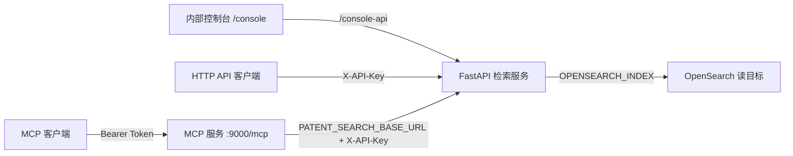

# 专利检索服务：项目总览

本文件说明本项目当前做什么、由哪些组件组成、使用哪些技术，以及版本发布的统一规则。它是总览，不替代接口、部署或索引切换的具体手册。

## 1. 项目目标与边界

本项目提供自托管的专利检索能力，面向三种使用方式：HTTP API、MCP 工具调用和内部网页控制台。核心职责是把检索请求转换为 OpenSearch 查询，并将结果稳定地映射为服务接口返回。

项目**不**负责专利原始数据的解析、ETL、批量入库或 OpenSearch mapping 的直接就地修改。这些工作与服务读路径分离；索引结构变化通过新物理索引、验证和受控切换完成。

## 2. 功能地图

| 能力 | 入口 | 说明 |
|---|---|---|
| 服务健康检查 | `GET /health` | 用于部署后存活检查。 |
| 专利检索 | `POST /api/patent/search` | 支持布尔查询、数据集、排序、分页和统一的 v2 查询语义。 |
| 专利详情 | `GET /api/patent/detail/{patent_id}` | 可选返回说明书。 |
| 引证信息 | `GET /api/patent/citations/{patent_id}` | 返回引用与被引摘要。 |
| 法律状态历史 | `GET /api/patent/legal-history/{patent_id}` | 返回法律状态基础结构。 |
| 内部控制台 | `/console` 与 `/console-api/*` | 随 FastAPI 静态托管的检索与详情查看界面。 |
| MCP 工具 | stdio 或 `POST /mcp` | 提供 `patent_search`、`patent_get_detail`、`patent_get_citations`、`patent_get_legal_history`。 |
| SaaS 工具适配 | `app/integrations/patenthub_adapter.py` | 将自托管 HTTP API 转换为工具层需要的数据结构；可按配置回退至外部 PatentHub。 |

HTTP API 路由使用 `X-API-Key` 鉴权；远程 HTTP MCP 使用 Bearer Token。当前控制台路由未挂接 API Key 依赖，因此只应在受控网络中提供，直到单独完成控制台鉴权改造。

## 3. 运行架构

FastAPI 是唯一直接访问 OpenSearch 的服务。MCP 服务通过 `PATENT_SEARCH_BASE_URL` 调用 FastAPI，不应自行建立 OpenSearch 客户端。`OPENSEARCH_INDEX` 可以是物理索引，也可以是稳定的读 alias。

## 4. 代码与技术组成

| 层次 | 采用技术 | 作用 |
|---|---|---|
| 运行时 | Python 3.11 | 服务运行与本地开发基线。 |
| Web 服务 | FastAPI 0.115.6、Uvicorn 0.34.0 | HTTP API、OpenAPI 文档、健康检查与控制台静态文件托管。 |
| 配置与校验 | Pydantic Settings 2.7.1 | 从 `.env` 读取运行配置，并校验检索请求。 |
| 检索存储 | OpenSearch、opensearch-py 2.8.0 | 执行查询、读取专利详情、引证和法律状态数据。 |
| MCP | MCP Python SDK 1.28.1 | 提供 stdio 与 Streamable HTTP 两种 MCP 传输。 |
| 服务间通信 | HTTPX 0.27.2 | MCP 和工具适配层调用自托管 HTTP API。 |
| 内部控制台 | 原生 HTML、CSS、JavaScript | 提供轻量检索和详情查看界面。 |
| 测试与检查 | Pytest 8.3.4、`make check` | 覆盖查询解析、DSL、映射、API、MCP、配置与路由契约。 |
| 部署 | Python venv、systemd | 部署 FastAPI 服务与 HTTP MCP 服务。 |

主要目录：

| 目录或文件 | 职责 |
|---|---|
| `app/` | FastAPI 路由、服务层、查询解析/DSL、OpenSearch 仓储、结果映射和工具适配。 |
| `mcp_server/` | MCP 服务、HTTP API 客户端与 MCP 使用说明。 |
| `app/static/console/` | 内部控制台前端资源。 |
| `tests/` | 可提交的单元与契约测试。 |
| `scripts/` | 本地检查和部署后的 smoke 脚本。 |
| `deployment/` | 两个 systemd 服务模板。 |
| `docs/` | 开发、部署和 OpenSearch 切换等正式工程文档。 |
| `local/` | 不提交的交付材料、会议记录、手工测试证据与原始测试数据。 |

`patent_harness_base_副本/` 是本地只读的 SaaS 契约参考副本，不属于当前可部署服务，也不应作为测试收集范围。

## 5. 当前运行与数据演进

### 服务版本

当前服务版本为 `0.2.0`，唯一来源是 `app/version.py`，FastAPI 从该模块读取版本。面向使用者的变更记录在 `CHANGELOG.md`；正式发布仍必须由 Git tag 指向实际部署的提交。

### OpenSearch v2

服务的读目标由 `OPENSEARCH_INDEX` 决定。代码会将该值原样传给 OpenSearch；它不会自动选择最新创建的物理索引，也不会自动复制旧索引的新写入。

v2 查询语义已在服务代码中适配：`IPCList` 使用直接 keyword 查询，普通文本、引号短语、实体字段和其他 keyword 字段各自采用固定 DSL。读路径切换仍须完成历史与增量数据对齐、serving 设置恢复、固定样本验收，并通过稳定读 alias 原子切换。详细步骤见 [docs/ops/opensearch_v2_cutover.md](docs/ops/opensearch_v2_cutover.md)。

这里的“v2”是**索引/mapping 版本**，不是服务软件版本。一个新的物理索引不等于一个新的服务发布版本。

## 6. 版本与发布规则

### 6.1 版本号语义

服务版本采用语义化版本：`MAJOR.MINOR.PATCH`，发布 tag 使用 `v` 前缀，例如 `v0.2.0`。

| 变化类型 | 版本变化 | 本项目示例 |
|---|---|---|
| 不兼容变更 | 升 `MAJOR` | 删除或改变已有 HTTP/MCP 参数、返回字段或鉴权方式。 |
| 向后兼容的新能力 | 升 `MINOR` | 新增可选查询能力、新增 MCP tool、增加不影响旧调用方的返回字段。 |
| 向后兼容的修复 | 升 `PATCH` | 修复 DSL、结果映射、鉴权或部署缺陷，且不改变既有契约。 |
| 仅文档或本地档案 | 不发布服务版本 | 提交 Git 即可；不需要重启服务。 |
| 仅索引 alias 切换且接口行为不变 | 记录一次运行变更 | 不必因 alias 本身升服务版本，但必须保存验收和回滚记录。 |
| 索引切换导致可观察查询语义或结果契约改变 | 通常升 `MINOR`，不兼容时升 `MAJOR` | 例如 IPC 查询语义调整导致调用方需要修改用法。 |

在 `0.x` 阶段，仍按上述规则管理；如果变更不兼容，可以升 `0.MINOR.0`。不要用日期、服务器目录名或物理索引名代替服务版本。

### 6.2 每次服务更新的标准流程

1. **定义变更**：建立单一主题分支，明确是否影响 HTTP API、MCP、数据查询语义、部署或配置。
2. **实现并测试**：同步更新代码与 `tests/`；涉及接口或运行方式时更新 README、总览或相应 `docs/ops/` 文档。
3. **本地验收**：运行 `make check`；必要时运行对应 smoke 脚本。
4. **决定版本**：按照上表选择新版本，写明变更摘要和升级/回滚影响。
5. **提交与标记**：合入主分支后，为已验证提交创建 Git tag，例如 `v0.1.1`；tag 必须指向实际部署的提交。
6. **发布服务器**：在服务器以该 tag/提交部署依赖和代码，重启 `patent-search-service.service` 与 `patent-mcp.service`。
7. **发布后验证**：确认两个服务存活，执行 `/health` 与对应 HTTP/MCP smoke；记录部署时间、Git 提交号、服务版本、验证结果和回滚点。
8. **需要回滚时**：代码回滚到上一个已验证 tag；若同时有索引变更，再将读 alias 原子切回旧索引，随后重启两项服务并复验。

常规服务发布和回滚命令见 [docs/ops/deployment_runbook.md](docs/ops/deployment_runbook.md)。索引切换必须额外遵循 [docs/ops/opensearch_v2_cutover.md](docs/ops/opensearch_v2_cutover.md)，不能只改环境变量后重启。

### 6.3 下一步应补齐的发布基础设施

版本源和变更日志已建立。每次正式发布仍应在 CI 或发布检查中核对 Git tag、版本号与变更日志的一致性，并记录 Git 提交号、部署时间和验证结果。

## 7. 文档导航与维护原则

| 文档 | 应在何时更新 |
|---|---|
| [README.md](README.md) | 项目入口、对外能力、运行状态或启动方式变化时。 |
| 本文件 | 功能地图、技术组成、架构边界或发布规则变化时。 |
| [docs/development.md](docs/development.md) | 开发、测试、分支或发布流程变化时。 |
| [docs/ops/deployment_runbook.md](docs/ops/deployment_runbook.md) | 服务部署、日志、回滚方式变化时。 |
| [docs/ops/opensearch_v2_cutover.md](docs/ops/opensearch_v2_cutover.md) | 索引 mapping、切换、验收或回滚规则变化时。 |
| [mcp_server/README.md](mcp_server/README.md) | MCP tools、传输或鉴权方式变化时。 |

只保留会影响代码、发布或运行决策的正式文档。交付材料、会议记录、手工测试证据和原始数据放在 `local/`，不随 Git 提交；其中若形成工程结论，应提炼回本文件或相关正式文档。
