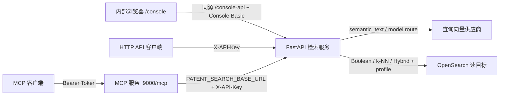

# 专利检索服务：项目总览

本文件说明本项目当前做什么、由哪些组件组成、使用哪些技术，以及版本发布的统一规则。它是总览，不替代接口、部署或索引切换的具体手册。

## 1. 项目目标与边界

本项目提供自托管的专利检索能力，面向三种使用方式：HTTP API、MCP 工具调用和内部网页控制台。核心职责是把检索请求转换为 OpenSearch 查询，并将结果稳定地映射为服务接口返回。

项目**不**负责专利原始数据的解析、ETL、批量入库或 OpenSearch mapping 的直接就地修改。这些工作与服务读路径分离。新增兼容字段可由数据工程独立实施；改变既有字段类型或 analyzer 才需要重建索引并受控切换。

## 2. 功能地图

| 能力 | 入口 | 说明 |
|---|---|---|
| 服务探针 | `GET /live`、`/startup`、`/ready` | 分别用于进程存活、启动完成和可接收检索流量检查。 |
| 兼容健康检查 | `GET /health` | 过渡期 liveness 兼容入口。 |
| 专利检索 | `POST /api/patent/search` | 同一入口支持 Boolean、向量和 Boolean+向量混合模式，共享数据集、排序、分页和统一响应。 |
| 专利详情 | `GET /api/patent/detail/{patent_id}` | 可选返回说明书。 |
| 引证信息 | `GET /api/patent/citations/{patent_id}` | 返回引用与被引摘要。 |
| 法律状态历史 | `GET /api/patent/legal-history/{patent_id}` | 返回法律状态基础结构。 |
| 内部控制台 | `/console` 与 `/console-api/*` | 随 FastAPI 托管，支持三种检索模式、字段多选、`top_k`、分页和详情查看。 |
| MCP 工具 | stdio 或 `POST /mcp` | 检索工具为 `patent_search`、`patent_vector_search`、`patent_hybrid_search`；另有详情、引证和法律状态工具。 |
| SaaS 工具适配 | `app/integrations/patenthub_adapter.py` | 将自托管 HTTP API 转换为工具层需要的数据结构；可显式配置改用外部 PatentHub；自托管请求失败时不会自动切换供应商。 |

HTTP API 使用 `X-API-Key`，远程 HTTP MCP 使用 Bearer Token。内部控制台使用一组与 `API_TOKEN` 不同的 HTTP Basic 凭据，同源 Console API 自动沿用浏览器认证；程序调用 Console API 时仍可使用 `X-API-Key`。后端 API Token 不进入 URL、HTML、浏览器存储或日志。

## 3. 运行架构

```mermaid
flowchart LR
    UI[内部浏览器 /console] -->|同源 /console-api + Console Basic| API[FastAPI 检索服务]
    Client[HTTP API 客户端] -->|X-API-Key| API
    McpClient[MCP 客户端] -->|Bearer Token| MCP[MCP 服务 :9000/mcp]
    MCP -->|PATENT_SEARCH_BASE_URL + X-API-Key| API
    API -->|semantic_text / model route| QV[查询向量供应商]
    API -->|Boolean / k-NN / Hybrid + profile| OS[OpenSearch 读目标]
```

FastAPI 是唯一直接访问 OpenSearch 的服务。MCP 的三个检索工具通过
`PATENT_SEARCH_BASE_URL` 调用同一 FastAPI 入口，不自行解析查询或建立
OpenSearch 客户端。FastAPI 在 `SearchService` 内分派 Boolean/Vector/Hybrid
策略；语义策略先通过独立适配器生成查询向量，再调用 OpenSearch。
`OPENSEARCH_INDEX` 可以是物理索引，也可以是稳定读 alias。

## 4. 代码与技术组成

| 层次 | 采用技术 | 作用 |
|---|---|---|
| 运行时 | Python 3.11 | 服务运行与本地开发基线。 |
| Web 服务 | FastAPI 0.115.6、Uvicorn 0.34.0 | HTTP API、OpenAPI 文档、健康检查与控制台静态文件托管。 |
| 配置与校验 | Pydantic Settings 2.7.1 | 从 `.env` 读取运行配置，并校验检索请求。 |
| 检索存储 | OpenSearch、opensearch-py 2.8.0 | 执行查询、读取专利详情、引证和法律状态数据。 |
| MCP | MCP Python SDK 1.28.1 | 提供 stdio 与 Streamable HTTP 两种 MCP 传输。 |
| 服务间通信 | HTTPX 0.27.2 | MCP 和工具适配层调用自托管 HTTP API。 |
| 内部控制台 | 原生 HTML、CSS、JavaScript | 提供轻量检索和详情查看界面。 |
| 测试与检查 | Pytest 8.3.4、`make check` | 覆盖查询解析、DSL、映射、API、MCP、配置与路由契约。 |
| 部署 | Python venv、systemd | 部署 FastAPI 服务与 HTTP MCP 服务。 |

主要目录：

| 目录或文件 | 职责 |
|---|---|
| `app/` | FastAPI 路由、服务层、查询解析/DSL、OpenSearch 仓储、结果映射和工具适配。 |
| `mcp_server/` | MCP 服务与 HTTP API 客户端；接入说明统一见 `docs/api.md`。 |
| `app/static/console/` | 内部控制台前端资源。 |
| `tests/` | 可提交的单元与契约测试。 |
| `scripts/` | 本地检查和部署后的 smoke 脚本。 |
| `deployment/` | FastAPI/MCP/Prometheus 服务模板、监控规则、日志权限及排序管道资产。 |
| `docs/` | 开发、部署和 OpenSearch 切换等正式工程文档。 |
| `local/` | 不提交的交付材料、会议记录、手工测试证据与原始测试数据。 |

`patent_harness_base_副本/` 是本地只读的 SaaS 契约参考副本，不属于当前可部署服务，也不应作为测试收集范围。

## 5. 版本、读目标与数据覆盖

服务版本唯一来源是 `app/version.py`。部署与数据验收要求见[部署核对清单](docs/ops/deployment_checklist.md)。

`OPENSEARCH_INDEX` 默认是 `patent_search_read`；代码将它原样传给 OpenSearch，不会自动选择最新物理索引、复制增量或创建回滚副本。v2/v3 是物理索引演进名称，与服务软件版本独立。

向量检索使用 `AbstractVector1024`、`MainClaimVector1024`、`IndependentClaimsVector1024`。接口支持、mapping 存在、搜索可见数据覆盖和容量验收分别核对，详见[向量文档](docs/vector_search.md)。

## 6. 管理面与维护入口

管理员看板面向运行维护人员，采用单一管理员身份，不提供 RBAC 或审批流。观测数据来自固定 Prometheus 查询与本实例日志；浏览器不能提交任意查询或服务器命令。配置草案只做预检与审计，运行时应用仅支持白名单中的四项参数，重启后回到部署基线。

产品边界与操作细节统一见[管理员手册](docs/ops/admin_dashboard.md)。版本号、检查和文档维护要求见[开发规范](docs/development.md)；部署操作见[部署手册](docs/ops/deployment_runbook.md)。
