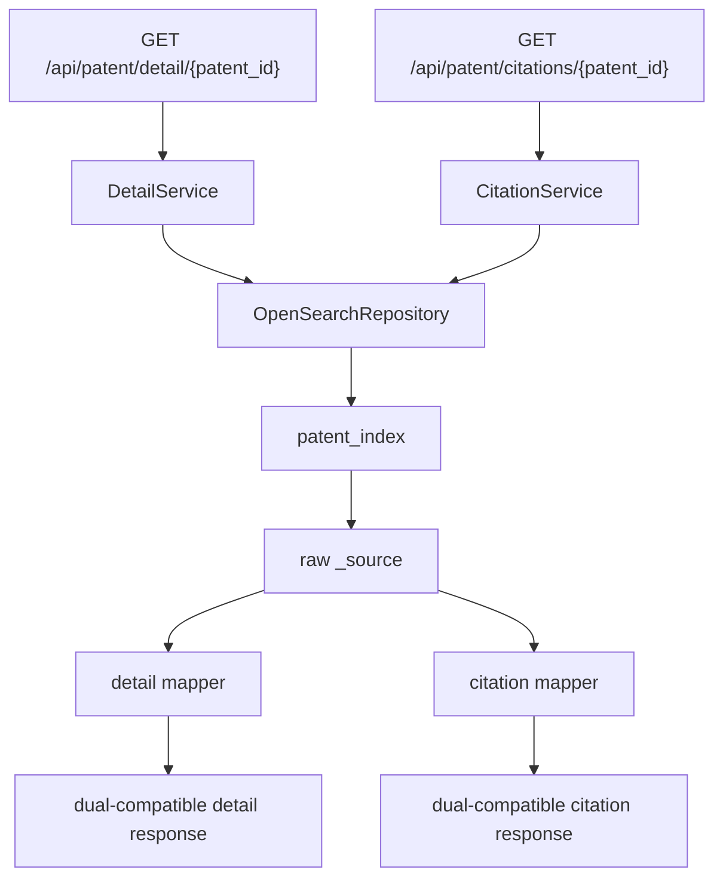

# Stage 7 Detail and Citations Design

## 1. Background

阶段 6.5 已完成 `index_analyzer_mode` 兼容查询，搜索主链路具备进入下一阶段的条件。阶段七目标是补齐检索之后的专利详情读取与引证/相关文献读取能力。

新增 SaaS 源码审计结论已记录在：

```text
docs/saas_patent_contract_audit.md
```

审计发现 SaaS 侧不是直接调用外采详情/引证 HTTP 接口，而是通过 DeerFlow Agent 的 PatentHub 工具调用：

```text
patent_get_detail
patent_get_citations
```

这些工具的真实契约定义在 SaaS 副本：

```text
patent_harness_base_副本/backend/packages/harness/deerflow/community/patenthub/tools.py
```

因此阶段七不能只按原 `docs/api_spec.md` 的宽泛描述实现；需要同时兼容本项目已有 HTTP API 风格和 SaaS 工具层实际消费的字段结构。

## 2. Goals

阶段七实现两个接口：

```text
GET /api/patent/detail/{patent_id}
GET /api/patent/citations/{patent_id}
```

目标：

1. 根据搜索结果中的 `id` / `patent_id` 查询同一篇专利详情。
2. 详情接口返回基础著录、标题、摘要、申请人、权利人、发明人、IPC、法律状态、权利要求。
3. `include_description=true` 时返回说明书长文本。
4. 引证接口返回被引、引用、非专利文献和原始兼容字段。
5. 成功响应保持业务对象直出，不强制包裹 `success/code/message/data`。
6. 错误响应沿用当前统一错误结构。
7. 不修改 SaaS 源码。
8. 不复制外采 PatentHub 的 60 分钟 session-bound ID 机制。

## 3. Non-Goals

阶段七不做：

1. 不做 SaaS 业务流程改造。
2. 不做阶段十 SaaS 联调。
3. 不实现企业专利画像 `enterprise_patent_portrait`。
4. 不实现独立法律历史接口 `patent_get_legal_history`。
5. 不做外采服务全量字段 100% 复刻。
6. 不修改 OpenSearch 索引 mapping。
7. 不重建索引。
8. 不解决 analyzer 分词缺陷；该问题已由阶段 6.5 兼容模式覆盖搜索主链路。

## 4. Contract Strategy

阶段七采用“双兼容”响应策略。

### 4.1 HTTP API compatibility

保留本项目已有 HTTP API 风格，继续输出 camelCase 字段：

```text
applicationNumber
documentNumber
applicationDate
documentDate
legalStatus
currentStatus
currentAssignee
mainIpc
ipcMainList
```

这保证阶段五、六形成的搜索返回风格不被打断，也方便普通业务后端直接消费。

### 4.2 SaaS tool compatibility

同时输出 SaaS PatentHub 工具层实际使用的 snake_case 字段：

```text
application_number
document_number
application_date
document_date
legal_status
current_status
current_assignee
main_ipc
```

引证接口同时输出：

```text
cited_by
patent_references
non_patent_references
```

这样后续如果 DeerFlow PatentHub 工具的 `base_url` 切到自研服务，字段迁移成本最低。

## 5. Identifier Strategy

外采 PatentHub 有临时会话 ID 约束：

```text
patent_search 返回的 id 有 60 分钟有效期；
patent_get_detail / patent_get_citations 必须使用最近一次 patent_search 返回的 id；
任意构造 id 可能返回 code=215。
```

自研服务不复制该机制。阶段七中：

1. `patent_id` 是稳定标识。
2. 搜索结果中的 `id` 与 `patent_id` 都应可直接用于详情和引证接口。
3. 为降低联调摩擦，接口可兼容 `PublicationNumber` / `documentNumber` / `ApplicationNumber` 查询。
4. 查询优先级为 `patent_id` 精确匹配，其次是 `PublicationNumber`，最后是 `ApplicationNumber`。

## 6. Architecture

阶段七沿用现有搜索链路分层：



新增模块：

```text
app/services/detail_service.py
app/services/citation_service.py
app/mappings/detail_mapper.py
app/mappings/citation_mapper.py
```

扩展模块：

```text
app/repositories/opensearch_repo.py
app/api/detail.py
app/api/citations.py
app/core/exceptions.py
```

## 7. Detail API

### 7.1 Request

```http
GET /api/patent/detail/{patent_id}
```

Query parameter:

| Parameter | Type | Required | Default | Description |
|---|---|---|---|---|
| `include_description` | boolean | no | `false` | 是否返回说明书长文本 |

### 7.2 Response Fields

详情响应直接返回对象。

核心标识字段：

| Field | Source |
|---|---|
| `id` | `patent_id` |
| `patent_id` | `patent_id` |

基础著录字段：

| camelCase field | snake_case alias | OpenSearch source |
|---|---|---|
| `applicationNumber` | `application_number` | `ApplicationNumber` |
| `documentNumber` | `document_number` | `PublicationNumber` |
| `applicationDate` | `application_date` | `ApplicationDate` |
| `documentDate` | `document_date` | `PublicationDate` |
| `type` | `type` | `Type` |
| `legalStatus` | `legal_status` | `LatestLegalStatus` then `LegalStatus` |
| `currentStatus` | `current_status` | `LatestLegalStatus` |

文本字段：

| Field | Alias | OpenSearch source |
|---|---|---|
| `title` | `ti` | `Title` |
| `abstract` | `ab` / `summary` | `Abstract` |
| `mainClaim` | `main_claim` | `MainClaim` |
| `claims` | none | `Requirement` |
| `description` | none | `Instructions` only when `include_description=true` |

主体字段：

| camelCase field | snake_case alias | OpenSearch source |
|---|---|---|
| `applicant` | none | `Applicant` |
| `firstApplicant` | `first_applicant` | `FirstApplicant` |
| `currentAssignee` | `current_assignee` | `Assignee` then `Applicant` |
| `assignee` | none | `Assignee` |
| `inventor` | none | `Inventor` |
| `firstInventor` | `first_inventor` | `FirstInventor` |
| `applicantAddress` | `applicant_address` | `ApplicantAddress` |
| `agency` | none | `Agency` |
| `agent` | none | `Agent` |

分类与扩展字段：

| camelCase field | snake_case alias | OpenSearch source |
|---|---|---|
| `ipc` | none | `IPC` |
| `mainIpc` | `main_ipc` | `IPC` |
| `ipcMainList` | `ipc_main_list` | `IPCList` |
| `loc` | none | `LOC` |
| `priorityNumber` | `priority_number` | `PriorityNumber` |
| `fullPriorityNumber` | `full_priority_number` | `FullPriorityNumber` |
| `pctDate` | `pct_date` | `PCTDate` |
| `pctApplicationData` | `pct_application_data` | `PCTApplicationData` |
| `pctPublicationData` | `pct_publication_data` | `PCTPublicationData` |
| `imagePath` | `image_path` | `AbstractFigureUrl` / `ImagePath` |
| `pdfList` | `pdf_list` | `PDFList` |
| `family` | none | `Family`, `SimpleFamily`, `ExtendedFamily`, `DocDBFamily` |
| `drawings` | none | `Drawings`, `DescriptionImages` |
| `legalStatusHistory` | `legal_status_history` | `LegalStatusHistory`, fallback `LegalStatus` |

字段缺失时遵循 `docs/field_mapping.md` 空值规则：

1. 字符串返回 `""`。
2. 数组返回 `[]`。
3. 对象或无法确定类型的复杂字段返回原始值；缺失时返回 `[]` 或 `{}` 由字段语义决定。
4. `description` 在 `include_description=false` 时不返回，避免长文本默认进入响应。

### 7.3 Example

```json
{
  "id": "cn-xxx",
  "patent_id": "cn-xxx",
  "title": "一种轴承座壳体的加工工艺",
  "ti": "一种轴承座壳体的加工工艺",
  "abstract": "本发明公开了一种...",
  "ab": "本发明公开了一种...",
  "summary": "本发明公开了一种...",
  "applicationNumber": "CN202411108082.1",
  "application_number": "CN202411108082.1",
  "documentNumber": "CN119188170B",
  "document_number": "CN119188170B",
  "applicationDate": "2024-08-13",
  "application_date": "2024-08-13",
  "documentDate": "2026-06-12",
  "document_date": "2026-06-12",
  "applicant": "某某公司",
  "currentAssignee": "某某公司",
  "current_assignee": "某某公司",
  "inventor": "张三;李四",
  "mainIpc": "B23P15/00",
  "main_ipc": "B23P15/00",
  "ipcMainList": ["B23P15/00", "B23Q3/00"],
  "legalStatus": "授权",
  "legal_status": "授权",
  "currentStatus": "授权",
  "current_status": "授权",
  "type": "发明专利",
  "mainClaim": "一种轴承座壳体的加工工艺，其特征在于...",
  "main_claim": "一种轴承座壳体的加工工艺，其特征在于...",
  "claims": "1. 一种轴承座壳体的加工工艺..."
}
```

## 8. Citations API

### 8.1 Request

```http
GET /api/patent/citations/{patent_id}
```

### 8.2 Response Fields

引证响应直接返回对象。

```json
{
  "patent_id": "cn-xxx",
  "cited_by": [],
  "patent_references": [],
  "non_patent_references": [],
  "referencesCited": [],
  "referencesCitedRaw": "",
  "referencesCitedText": "",
  "relatedDocuments": []
}
```

字段含义：

| Field | Source | Meaning |
|---|---|---|
| `patent_id` | request / `_source.patent_id` | 专利稳定 ID |
| `cited_by` | `RelatedDocuments` best-effort normalized | 被引专利摘要列表 |
| `patent_references` | `ReferencesCited` best-effort normalized | 引用专利摘要列表 |
| `non_patent_references` | `ReferencesCitedRaw` / `ReferencesCitedText` | 非专利文献或原始引用文本 |
| `referencesCited` | `ReferencesCited` | 原始结构化引证字段 |
| `referencesCitedRaw` | `ReferencesCitedRaw` | 原始引证文本 |
| `referencesCitedText` | `ReferencesCitedText` | 文本化引证列表 |
| `relatedDocuments` | `RelatedDocuments` | 原始相关文献 |

引用专利摘要如能结构化，字段按 SaaS 工具层格式输出：

| Field | Meaning |
|---|---|
| `id` | 引用专利 ID |
| `title` | 标题 |
| `applicant` | 申请人 |
| `application_date` | 申请日 |
| `application_number` | 申请号 |
| `type` | 专利类型 |
| `legal_status` | 法律状态 |
| `main_ipc` | 主 IPC |

如果 OpenSearch 中 `ReferencesCited` 或 `RelatedDocuments` 已是结构化数组，则 mapper 尽量归一化为上述摘要字段；如果是字符串或未知结构，则保留原始值到兼容字段中，`patent_references` / `cited_by` 返回空数组。

## 9. Repository Query Design

阶段七为 repository 增加按标识查单篇专利的方法：

```text
get_patent_by_identifier(identifier: str) -> dict | None
```

查询策略：

1. 先按 `patent_id` 查询。
2. 未命中时按 `PublicationNumber` 查询。
3. 未命中时按 `ApplicationNumber` 查询。
4. 只取 1 条。
5. 不使用 `match_all`。
6. 不使用 analyzer-risk 字段做详情定位。

如果 OpenSearch 字段存在 `.keyword` 子字段，优先使用 keyword 精确查询；否则使用 `term` / `match_phrase` 的最小组合，并在测试中固定 DSL 结构。

## 10. Error Handling

成功响应：

1. `detail` 和 `citations` 成功时直接返回业务对象。
2. 不包裹 `success/code/message/data`。

失败响应：

| Scenario | HTTP | code | message |
|---|---:|---:|---|
| `patent_id` 为空或非法 | 400 | `40002` | `patent_id 参数非法` |
| 专利不存在 | 404 | `40401` | `patent not found` |
| OpenSearch 查询异常 | 502 | `50001` | `OpenSearch 查询异常` |
| 未授权 | 401 | `40101` | `missing or invalid X-API-Key` |

错误响应沿用当前结构：

```json
{
  "success": false,
  "code": 40401,
  "message": "patent not found",
  "data": null
}
```

## 11. Testing Strategy

阶段七测试分四层：

1. Mapper 单测：验证 detail/citation 字段映射、别名、空值规则、`include_description` 控制。
2. Service 单测：验证按 ID 查询、未命中抛出 404、repository 异常转 50001。
3. API 单测：验证鉴权、路径、query 参数、成功响应、错误响应。
4. Live smoke：用真实 OpenSearch 搜索得到一个 `patent_id`，再调用 detail/citations。

必须覆盖：

1. `include_description=false` 不返回 `description`。
2. `include_description=true` 返回 `description`。
3. detail 同时返回 camelCase 和 snake_case 关键字段。
4. citations 同时返回 SaaS 工具字段和原始兼容字段。
5. 不存在 ID 返回 `40401`。
6. 阶段六/六点五搜索测试不回退。

## 12. Documentation Updates

阶段七开发时需要同步更新：

```text
docs/api_spec.md
docs/field_mapping.md
docs/stage7_dev_assignment.md
docs/stage7_test_acceptance.md
docs/stage7_test_report.md
```

阶段七还应保留本设计引用：

```text
docs/saas_patent_contract_audit.md
```

## 13. Acceptance Criteria

阶段七通过标准：

1. `GET /api/patent/detail/{patent_id}` 可返回真实 OpenSearch 专利详情。
2. `GET /api/patent/detail/{patent_id}?include_description=true` 可返回说明书。
3. `GET /api/patent/citations/{patent_id}` 可返回引证/相关文献对象。
4. detail 响应包含 HTTP API camelCase 字段和 SaaS 工具 snake_case 字段。
5. citations 响应包含 `cited_by`、`patent_references`、`non_patent_references` 以及原始兼容字段。
6. 专利不存在返回 `40401`。
7. OpenSearch 异常返回 `50001`。
8. 自动化测试全部通过。
9. 不修改 SaaS 副本源码。
10. 不修改 OpenSearch mapping。
11. 不进入 SaaS 联调阶段。

## 14. Next Step

本设计确认后，进入阶段七实施计划编写：

```text
docs/superpowers/plans/2026-07-06-stage-7-detail-citations.md
```
